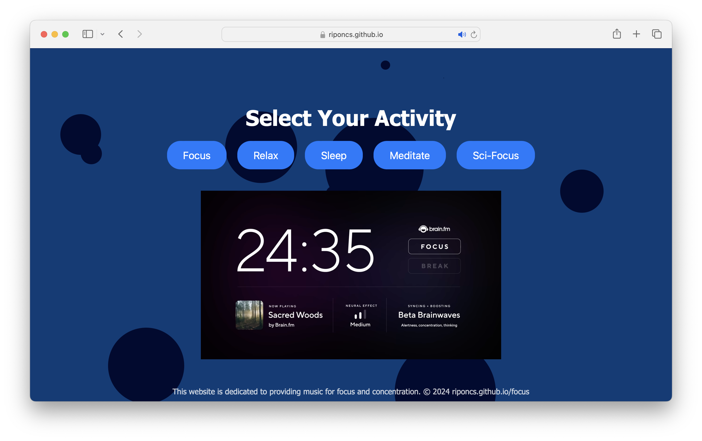

# Focus Music Selector
Visit the Focus Music Selector website: [riponcs.github.io/focus](https://riponcs.github.io/focus)

A dynamic and interactive web application designed to help you find the perfect music for enhancing your focus, relaxation, sleep, meditation, or sci-fi inspired concentration. This tool features curated playlists tailored to different activities, allowing you to seamlessly switch between music categories that best suit your needs.

## Categories

- **Focus**: Music specifically selected to help you concentrate and maintain peak mental performance during work or study sessions.
- **Relax**: Calm and soothing tracks to help you unwind and reduce stress after a long day.
- **Sleep**: Gentle and serene music designed to lull you into a deep, restful sleep.
- **Meditate**: Peaceful and ambient sounds to guide you through meditation or moments of mindfulness.
- **Sci-Focus**: Futuristic and science fiction-inspired music that stimulates creativity and deep thinking.

Each category provides a unique auditory experience, scientifically crafted to support specific mental states and activities. Explore the different categories to find the perfect soundtrack for your task at hand.
